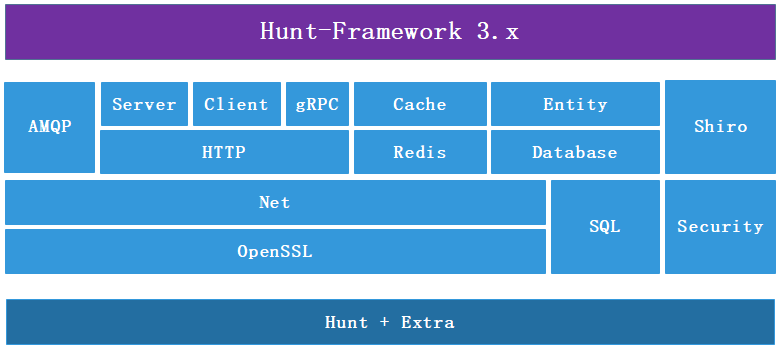

[](https://travis-ci.org/huntlabs/hunt-framework)

## Hunt framework
[Hunt](http://www.huntframework.com/) is a high-level [D Programming Language](http://dlang.org/) Web framework that encourages rapid development and clean, pragmatic design. It lets you build high-performance Web applications quickly and easily.



## Getting Started
- [Installation](https://github.com/huntlabs/hunt-framework-docs/blob/master/installation.md)
- [Server Configuration](https://github.com/huntlabs/hunt-framework-docs/blob/master/configuration.md)

### Create a project
```bash
git clone https://github.com/huntlabs/hunt-skeleton.git myproject
cd myproject
dub run -v
```

Open the URL with the browser:
```bash
http://localhost:8080/
```

### Router config
config/routes
```conf
#
# [GET,POST,PUT...]    path    controller.action
#

GET     /               index.index
GET     /users          user.list
POST    /user/login     user.login
*       /images         staticDir:public/images

```

### Add Controller
```D
module app.controller.index;

import hunt.framework;

class IndexController : Controller
{
    mixin MakeController;

    @Action
    string index()
    {
        return "Hello world!";
    }
}
```

For more, see [hunt-skeleton](https://github.com/huntlabs/hunt-skeleton) or [hunt-examples](https://github.com/huntlabs/hunt-examples).

## Resources
- [Documentation](https://github.com/huntlabs/hunt-framework-docs)
- [Articles](https://github.com/huntlabs/hunt-framework-articles)

## Community
- [Issues](https://github.com/huntlabs/hunt-framework/issues)
- QQ Group: 184183224 
- [D语言中文社区](https://forums.dlangchina.com/)

